# Speech Recognition   (DSAI 456)
# Lecture 1 

Mohamed Ghalwash
<Email v="mghalwash@zewailcity.edu.eg" />

---
transition: fade-out
layout: top-title
---

:: title :: 

# Speech Sounds and Phonetic Transcription

:: content :: 

- Represent the pronunciation as a string of phones (speech sounds) which has special alphabets (IPS international phonetics alphabets)

- Mapping between letters of english (orthography) and phones (sound-orthography mapping)
  
  _e.g: 'c' can be mapped to phone 'k' or phone 's'_

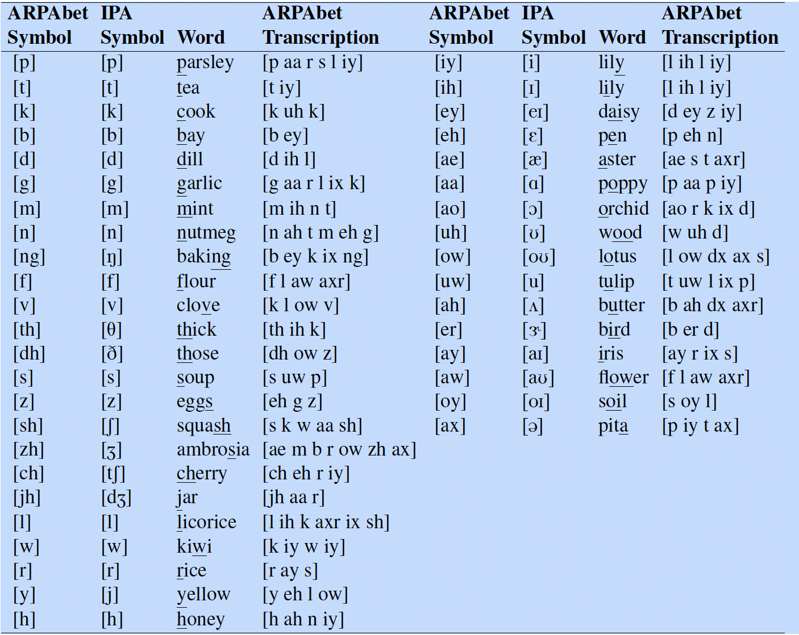{width=320}

<BottomBar/>

---
transition: fade-out
layout: side-title
titlewidth: is-2
---

:: title :: 

# Speech Sounds and Phonetic Transcription

:: content :: 

- Time-aligned transcription: mapping between waveform and phones (TIMIT corpus)

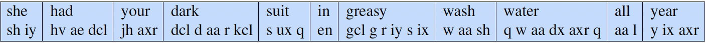

- Articulatory phonetics
  
	- consonant vs vowel 

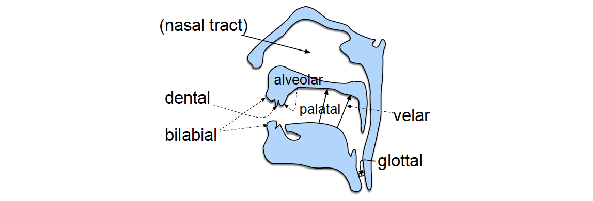

<BottomBar/>

---
transition: fade-out
layout: side-title
titlewidth: is-2
---

:: title :: 

# Speech Sounds and Phonetic Transcription

:: content :: 

- Syllable:  a vowel-like sound together with some of the surrounding consonants that are most closely associated with it

  - `dog` has one syllable (d aa g), `catnip` has two (k ae t) and (n ih p)

  - The vowel at the core of a syllable is called the **nucleus**
  
  - Initial consonants are called the **onset** (as in strike (s t r ay k))

  - The **coda** is the optional consonant or sequence of consonants following the nucleus

  - The rime, or rhyme, is the nucleus plus coda

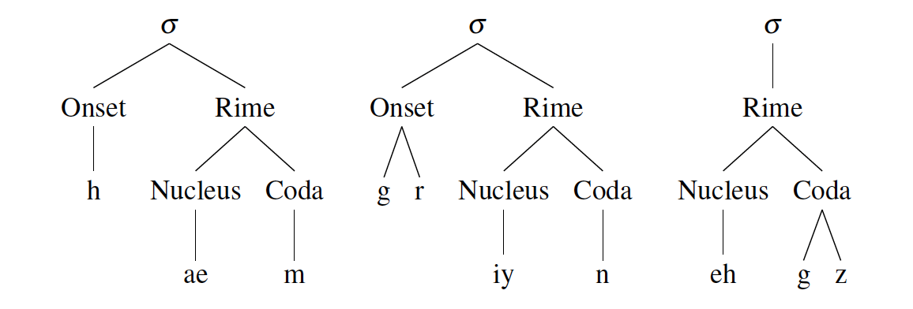{width=500}

<BottomBar/>

---
layout: top-title-two-cols
---

:: title :: 

# Signal Representation

:: left :: 

- Signal is a waveform 

- Air passes through the glottis -> air pressure -> sound waves

- Waveform can be represented as a combination of `sin` or `cos` functions, e.g. $y = A\; sin(2 \pi f t)$

  - $A$ is the **amplitude**: the maximum value on the Y-axis
  - $f$ is the **frequency**: number of cycles per second
  
<!-- 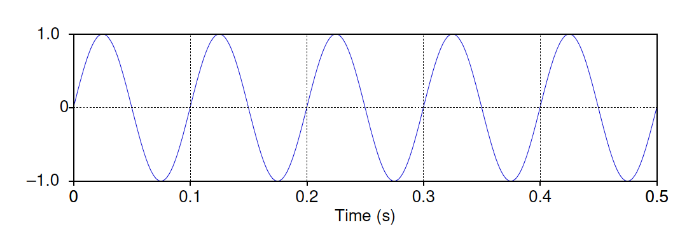 -->

:: right :: 

- y-axis the amount of air pressure variation

- **Hertz**: number of cycles per second

- The **period** T of the wave is the time it takes for one cycle to complete, i.e. $T = 1/f$

<BottomBar/>

---
layout: center
class: text-center
---

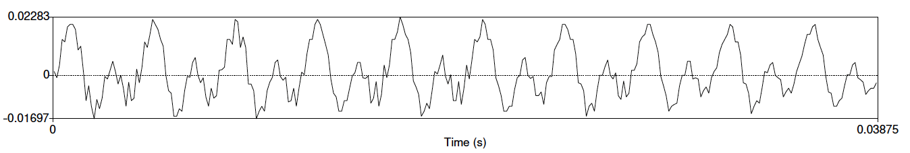

A waveform of the vowel (iy). The y-axis shows the level of air pressure above and below normal atmospheric pressure.

<BottomBar/>

---
layout: top-title
---

:: title :: 

# Analog to Digital

:: content :: 

	- Sampling (sampling rate is at least twice the frequency)
  
	- Digitization (stored as integers)

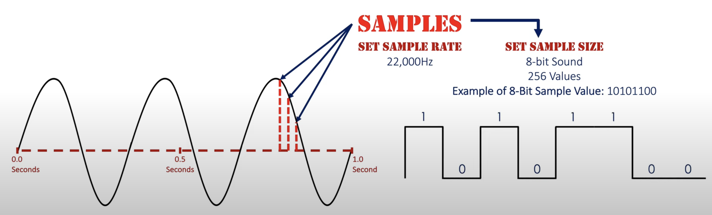
  
      - telephone speech is often sampled at 8 kHz and stored as 8-bit samples
      - microphone data is often sampled at 16 kHz and stored as 16-bit samples

<BottomBar/>

---
layout: top-title
---

:: title :: 

# Analog to Digital

:: content :: 

  - _Human hearing is more sensitive at small intensities than large ones_ 
  
  - Compression (linear vs log compression algorithms like $\mu$-law)
	
  - The log represents small values with more faithfulness at the expense of more error on large values

  - `.wav` file 

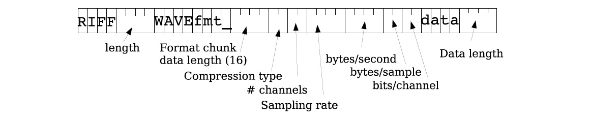

<BottomBar/>

---
# layout: image-right
# image: ./images/sound-waves.png
layout: two-cols-title
columns: is-8
---

:: title :: 

# Pitch and Loudness

:: left :: 

- Pitch (Hz): pitch is our perception of the frequency of the sound wave, meaning how high or low a sound seems to be
  
  - High-pitched sounds, like a whistle, are caused by sound waves with a high frequency 
  - Low-pitched sounds, like a deep bass note, are caused by sound waves with a low frequency 
  - pitch is subjective and linked to how the sound is heard rather than the exact physical frequency
  
- Loudness (decibel dB) is a measure of intensity $I$ of sound ($I \alpha A^2$)

<!-- https://www.youtube.com/watch?v=eA19gFOH1JA -->

:: right ::

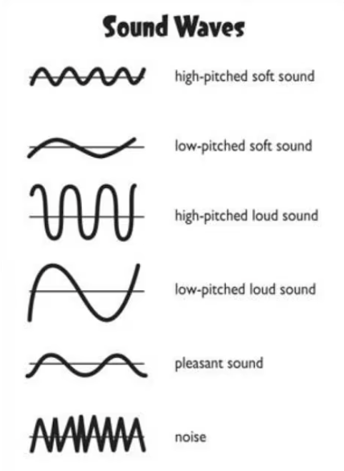

<BottomBar/>

---
layout: center
class: text-center
---

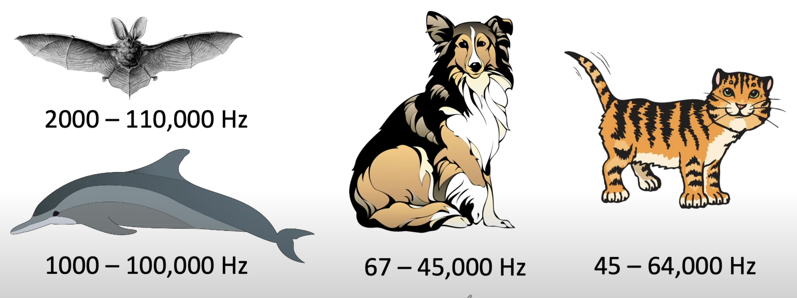

Human can hear sound of frequencies between 20Hz and 20kHz. 

# Hearing ranges 

<BottomBar/>

---
layout: top-title
---
:: title :: 

# Features

:: content :: 

- Intensity 

<v-clicks>

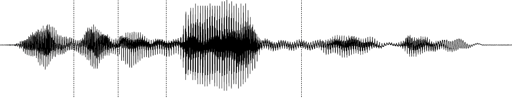

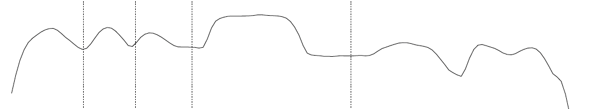

</v-clicks>

<BottomBar/>

---
layout: top-title
---
:: title :: 

# Features

:: content :: 

- RMS (root-mean-square) of amplitude ($\sqrt{\frac{1}{n}\sum_{t=1}^{n}a_t^2}$): the average amplitude over some time range, to give us some idea of how great the average displacement of air pressure is 

- F0 (fundamental frequency): the lowest frequency of a periodic waveform
    
- Pitch track: is a time-based representation that shows how the pitch (perceived frequency) of a sound changes over time

- Frame-by-frame, short overlapping time frames

<!-- https://www.youtube.com/watch?v=eA19gFOH1JA -->

<BottomBar/>

---
layout: top-title
---
:: title ::

# Interpretation of Phones from a Waveform

:: content :: 

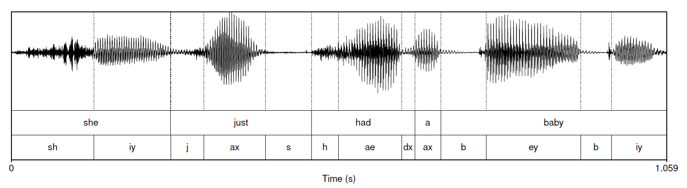

<v-click>

  - Vowels are pretty easy to spot. They are voiced, tend to be long, and are relatively loud
  - Each of the six vowels have regular amplitude peaks indicating voicing
  - Each major peak corresponding to an opening of the vocal folds

  - A stop consonant consists of a closure followed by a release. Can be seen as a period of silence followed by a slight burst of amplitude
  - fricative consonant: when a narrow channel for airflow causes noisy, turbulent air

</v-click>

<BottomBar/>

---
layout: center
class: text-center
---

# Learn More

[Slidev](https://sli.dev) · [Course Homepage](https://github.com/m-fakhry/DSAI-456-SR)
