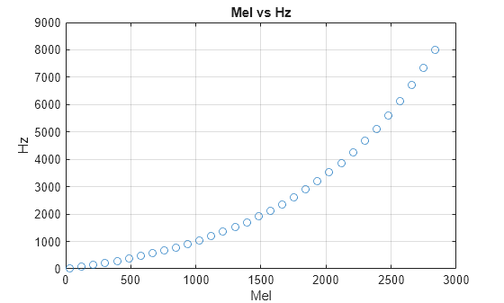

# Speech Recognition   (DSAI 456)
## Lecture 2

Mohamed Ghalwash
<Email v="mghalwash@zewailcity.edu.eg" />

---
transition: fade-out
layout: top-title
---

:: title :: 

# Lecture 1 Recap 

:: content :: 

- Phonetics, Syllables 

- Signal Representation 
  
- Analog to digital 

- Transform the input waveform into a sequence of acoustic features 
  
- Features: pitch, loudness, intensity, F0 tracks

<BottomBar/>

---
layout: section
titlewidth: is-3
---

# What is 
  
- ### Frequency Spectrum

- ### Frequency Bands
  
- ### Frequency Spectrogram

- ### Mel Spectrum 

<BottomBar/>

---
layout: side-title
titlewidth: is-3
class: text-center
---
:: title :: 

# Frequency Spectrum 

:: content ::

<v-click>

  <i class="i-mdi-emoticon-angry-outline"></i>
  It does not look like a sine waveform

</v-click>

<BottomBar/>

---
layout: side-title
titlewidth: is-3
---
:: title :: 

# Frequency Spectrum 

:: content ::

 Maybe a combination of sine waveforms  _with different frequencies and amplitude_

<BottomBar/>

---
layout: side-title
titlewidth: is-3
---
:: title :: 

# Frequency Spectrum 

:: content ::

  <i class="i-ic-baseline-lightbulb-circle"></i>
  Aha! I got it

<BottomBar/>

---
layout: side-title
titlewidth: is-3
---
:: title :: 

# Frequency Spectrum 

:: content ::

Done using  Discrete Fourier Transform 
<BottomBar/>

---
layout: four-cell
---

:: top-left ::

:: bottom-left ::

:: top-right ::

:: bottom-right ::

<BottomBar/>

---
layout: side-title
titlewidth: is-3
---

:: title :: 

# Frequency Bands

:: content :: 

- Phones have characteristic spectral _signatures (Spectral peaks)_

- Inner ear computes the spectrum of the incoming waveform

- Spectrogram for three vowels
  

<!-- dark is more important because amplitude for white region is almost zero -->
<!-- which frequency range the dark area is -->

- Each dark bar is called a **formant** which is a frequency band that is particularly amplified by the vocal tract

<BottomBar/>

---
layout: full
titlewidth: is-3
---

<BottomBar/>

---
layout: image-right
image: ./images/lec2_ear.png
---

# Issues with Hz

- Human hearing is less sensitive at higher frequencies
- The difference at low frequencies 50 Hz to 550 Hz is a massive change in perceived pitch
- However, the difference at high frequencies 13kHz to 15kHz is not a significant change in perceived pitch

- Information in low frequencies (like formants) is crucial for distinguishing vowels or nasals
- Modeling this human perceptual property improves speech recognition performance in the same way

<BottomBar/>
---
layout: top-title-two-cols
columns: is-6
align: l-lt-cm
---

:: title :: 

# Mel to the Rescue 

:: left :: 

- Designed to match human perception of pitch: how humans _perceive_ sound at different frequencies
- Equal intervals in mels represent equal perceived distances between pitches to a human listener
- The scale is anchored at 1000 Hz being equal to 1000 mels
- Below approximately 500 Hz, the mel and Hz scales are roughly equivalent

  $mel(f) = 2595 \log(1+\frac{f}{700})$

:: right :: 

<BottomBar/>

---
layout: center
class: text-center
---

# Learn More

[Slidev](https://sli.dev) · [Course Homepage](https://github.com/m-fakhry/DSAI-456-SR)
