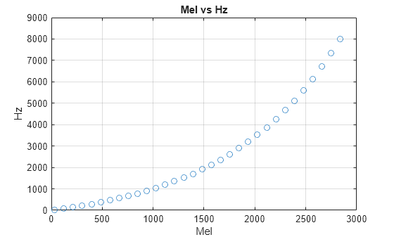
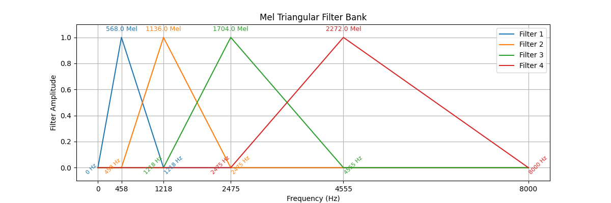
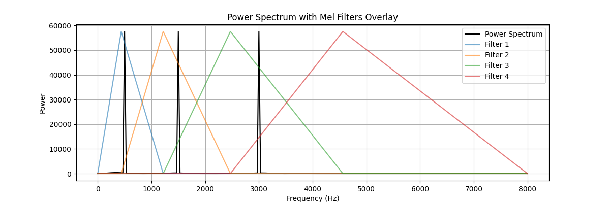
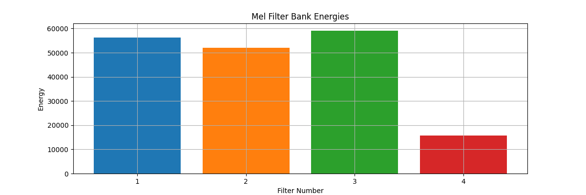

# Speech Recognition   (DSAI 456)
## Lecture 3

Mohamed Ghalwash
<Email v="mghalwash@zewailcity.edu.eg" />

---
transition: fade-out
layout: top-title
---

:: title :: 

# Lecture 2 Recap 

:: content :: 

- Waveform is combined of several sinusoidal waveforms 
  
- Frequency Spectrum (Freq VS Amplitude)

- Spectrogram (Time vs Freq vs Amplitude)
  
- Mel 

<BottomBar/>

---
layout: section
titlewidth: is-3
---

# What is 
  
- ### Mel Spectrum

- ### MFCC
  
- ### DFT

<BottomBar/>

---
layout: top-title-two-cols
columns: is-6
align: l-lt-cm
---

:: title :: 

# Mel to the Rescue 

:: left :: 

- Designed to match human perception of pitch: how humans _perceive_ sound at different frequencies
- Equal intervals in mels represent equal perceived distances between pitches to a human listener
- The scale is anchored at 1000 Hz being equal to 1000 mels
- Below approximately 500 Hz, the mel and Hz scales are roughly equivalent

  $mel(f) = 2595 \log(1+\frac{f}{700})$

:: right :: 

<BottomBar/>

---
layout: top-title
---

:: title :: 

# Frequency Spectrum to Mel Spectrum

:: content :: 

- Mel channels (bands) are equally spaced points between lower/upper mels
- A series of triangular filters are created, with each filter centered at a point on the Mel scale
- Each filter captures the energy within its respective frequency band

<BottomBar/>

---
layout: top-title
---

:: title :: 

# Frequency Spectrum to Mel Spectrum

:: content :: 

- Multiply (overlay) filters by the frequency spectrum 

<BottomBar/>

---
layout: top-title
---

:: title :: 

# Frequency Spectrum to Mel Spectrum

:: content :: 

- Each filter captures the energy within its respective frequency band
- The scalar output from each filter is called a _channel (band)_
- The output for each input frame from the filter bank is a vector, represents the log energy of (mel-spaced) frequency bands

<BottomBar/>

---
layout: center
class: text-center
---

# Learn More

[Slidev](https://sli.dev) · [Course Homepage](https://github.com/m-fakhry/DSAI-456-SR)
