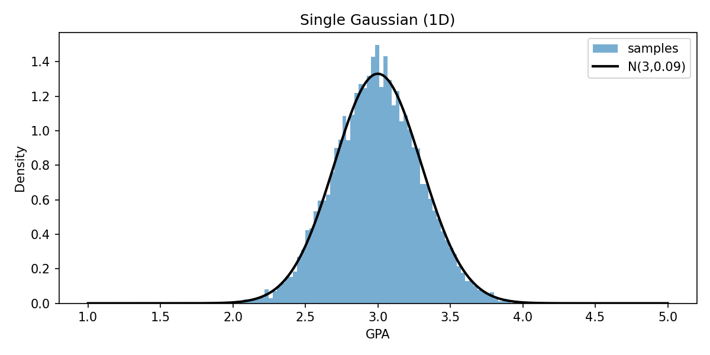
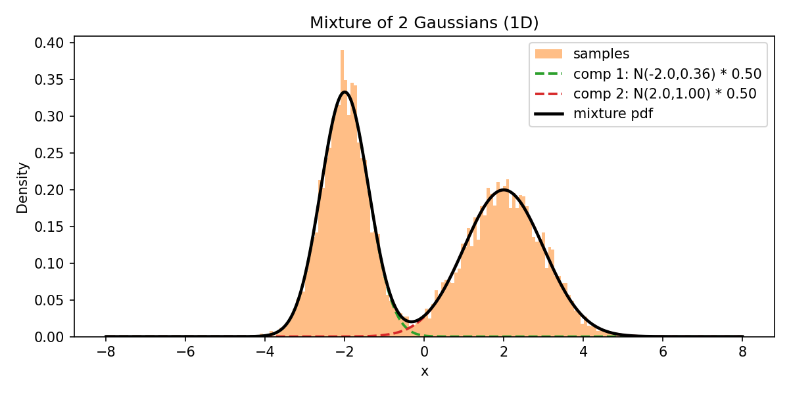
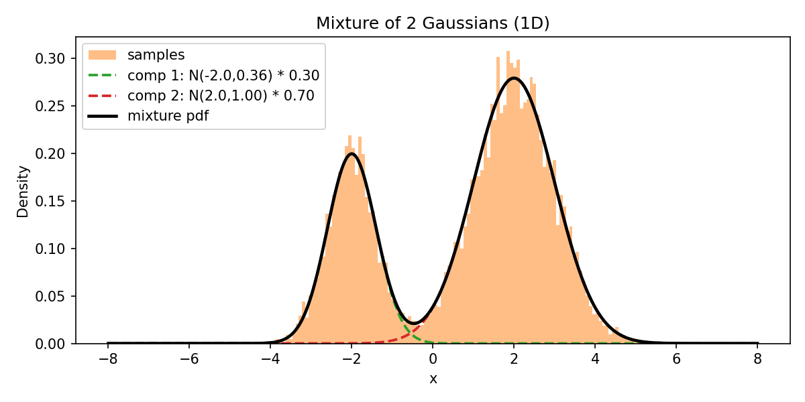
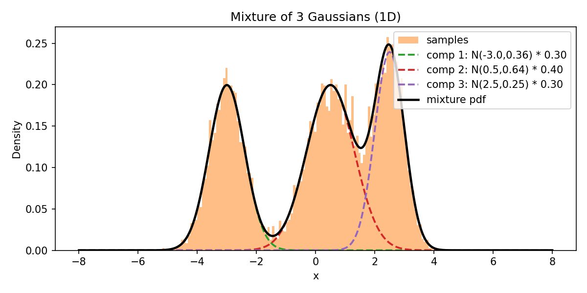
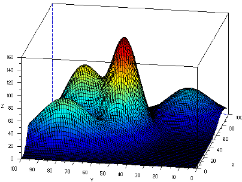
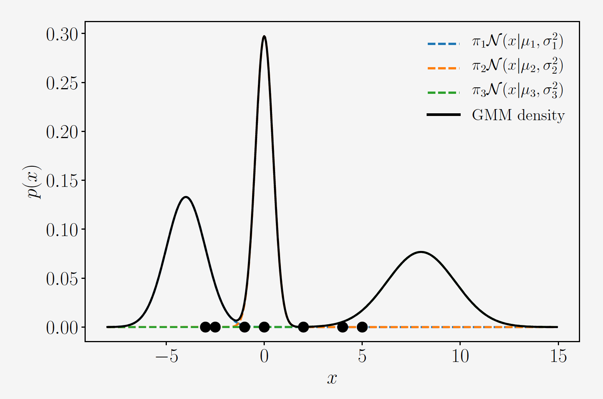
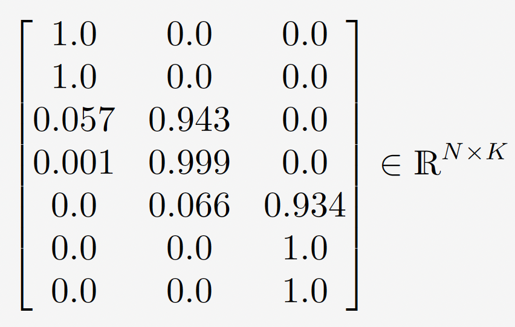

<!-- <style>
  h1 { color: #2c7be5; }
  .center { text-align: center; }
  img { max-width: 85%; border-radius: 6px; }
</style> -->

# Speech Recognition <br> (DSAI 456)
## Lecture 4

Mohamed Ghalwash
<Email v="mghalwash@zewailcity.edu.eg" />

---
layout: top-title
---

:: title :: 

# Lecture 3 Recap 

:: content :: 
  
- Mel Spectrum 
- Mel Filter Bank
- MFCC

<BottomBar/>

---
layout: top-title 
---

:: title :: 

# Agenda 

:: content :: 

- Motivation and intuition
- Mathematical formulation
- EM algorithm (E-step / M-step)
- Using GMMs in speech recognition 
- Practical tips

<BottomBar/>

---
layout: top-title 
---

:: title :: 

# Motivation: GPA Distribution 

:: content :: 

{width=60% style="margin: auto;"}

$$GPA \sim \mathcal{N}(\mu,\sigma)$$

$$
p(GPA) = \mathcal{N}(GPA\mid \mu, \sigma^{2}) \;=\; \frac{1}{\sqrt{2\pi\sigma^{2}}}\,\exp\!\left(-\frac{(GPA-\mu)^{2}}{2\sigma^{2}}\right)
$$

<BottomBar/>

---
layout: top-title 
---

:: title :: 

# Motivation: Two Distributions 

:: content :: 



$$x \sim \textcolor{green}{\mathcal{N_1}(\mu_1,\sigma_1)} + \textcolor{red}{\mathcal{N_2}(\mu_2,\sigma_2)}$$

<BottomBar/>

---
layout: top-title 
---

:: title :: 

# Motivation: Two Distributions 

:: content :: 



$$x \sim \textcolor{green}{\mathcal{N_1}(\mu_1,\sigma_1)} + \textcolor{red}{\mathcal{N_2}(\mu_2,\sigma_2)}$$

<v-click>

<Admonition title="Should be weighted sum" color='teal-light' width="300px" v-drag="[660,450,310,60]">

$x \sim  \textcolor{green}{0.3 * \mathcal{N_1}(\mu_1,\sigma_1)} + \textcolor{red}{0.7 * \mathcal{N_2}(\mu_2,\sigma_2)}$

</Admonition>

</v-click> 


<BottomBar/>

---
layout: top-title 
---

:: title :: 

# Motivation: Three Distributions

:: content :: 



$$x \sim  \textcolor{green}{0.3 * \mathcal{N_1}(\mu_1,\sigma_1)} + \textcolor{red}{0.4 * \mathcal{N_2}(\mu_2,\sigma_2)} +  \textcolor{purple}{ 0.3 * \mathcal{N_2}(\mu_2,\sigma_2)} $$


<BottomBar/>

---
layout: top-title 
class: text-center 
---

:: title :: 

# Motivation: Mixture of Multivariate Distributions

:: content :: 

{style="margin: auto;"}


<BottomBar/>

---
layout: top-title
---

:: title :: 

# Univariate vs Multivariate 

:: content ::

## Each component is modeled as 

- Univariate 
  
$$
p(x) = \mathcal{N}(x\mid \mu, \sigma^{2}) \;=\; \frac{1}{\sqrt{2\pi\sigma^{2}}}\,\exp\!\left(-\frac{(x-\mu)^{2}}{2\sigma^{2}}\right)
$$

- Multivariate
$$
p(x) = \mathcal{N}(x\mid\mu,\Sigma)=\frac{1}{(2\pi)^{D/2}|\Sigma|^{1/2}}
\exp\!\left(-\frac{1}{2}(x-\mu)^\top\Sigma^{-1}(x-\mu)\right)$$

  
<BottomBar/>

---
layout: intro
---

# Gaussian Mixture Model

A weighted sum of Gaussian components used to model complex continuous distributions


<BottomBar/>

---
layout: top-title
---

:: title :: 

# What is a GMM?

:: content :: 

- Density
$$
p(x)=\sum_{k=1}^K \pi_k \,\mathcal{N}(x\mid\mu_k,\Sigma_k) \\ 
\text{such that } \sum_{k=1}^K \pi_k = 1,\quad \pi_k \ge 0
$$

- Parameters: 
  - weight $\pi_k$
  - mean $\mu_k$
  - covariance $\Sigma_k$

<BottomBar/>


---
layout: top-title
title: 
---

:: title :: 

# Parameter Estimation 

:: content :: 

### How to learn parameters of the GMM? 

- **Problem:** Parameters are multiplied 

$$p(x)=\sum_{k=1}^K \pi_k \,\mathcal{N}(x\mid\mu_k,\Sigma_k)$$

- **Solution:** Iterative algorithm 

<BottomBar/>

---
layout: top-title
---

:: title :: 

# Responsibilities (soft assignments)

:: content ::

The responsibility $r_{nk}$ represents the probability that  $x_n$ has been generated by the $k^{th}$ component

<div class="grid w-full h-fit grid-cols-2 grid-rows-2 mt-2 mb-auto">
  <div class="grid-item grid-col-span-1"></div>
  <div class="grid-item grid-col-span-1"></div>
  <div class="grid-item grid-col-span-2 text-center h-fit">

$$
r_{nk} = \frac{\pi_k \,\mathcal{N}(x_n\mid\mu_k,\Sigma_k)}{\sum_{j=1}^K \pi_j \,\mathcal{N}(x_n\mid\mu_j,\Sigma_j)} \\ 
N_k = \sum_{k=1}^K r_{nk}
$$

  </div>
</div>

<BottomBar/>

---
layout: top-title 
---

:: title :: 

# Optimization: Maximum Likelihood 

:: content :: 

- Full data likelihood


$$
\begin{aligned}
p(X\mid\theta) &=\prod_{n=1}^N p(x_n|\theta)  \\
\Rightarrow \log p(X\mid\theta) &= \log \prod_{n=1}^N p(x_n|\theta) \\
&= \sum_{n=1}^N  \log p(x_n|\theta)  \\  
\Rightarrow  \mathcal{L} &= \sum_{n=1}^N  \log p(x_n|\theta) + \lambda \Big(\sum_{k=1}^{K}\pi_k - 1\Big) \\    
\end{aligned}
$$

<BottomBar/>


---
layout: top-title 
---

:: title :: 

# Derivation: closed-form for $\pi_k$ (E-step)

:: content :: 

$$
\begin{aligned}
\frac{\partial \mathcal{L}}{\partial \pi_j}
&= \sum_{n=1}^N \frac{\partial \log p(x_n|\theta)}{\partial \pi_j}  + \lambda \\ 
&= \sum_{n=1}^N \frac{1}{p(x_n|\theta)} \frac{\partial \textcolor{green}{p(x_n|\theta)}}{\partial \pi_j}  + \lambda\\ 
&= \sum_{n=1}^N \frac{1}{p(x_n|\theta)} \frac{\partial \textcolor{green}{\sum_{k=1}^K \pi_k \,\mathcal{N}(x_n\mid\mu_k,\Sigma_k)}}{\partial \pi_j} + \lambda \\ 
&= \sum_{n=1}^N \frac{1}{\textcolor{red}{p(x_n|\theta)}} \mathcal{N}(x_n\mid\mu_j,\Sigma_j) + \lambda \\ 
&= \sum_{n=1}^N \frac{\mathcal{N}(x_n\mid\mu_j,\Sigma_j)}{\textcolor{red}{\sum_{k=1}^K \pi_k \,\mathcal{N}(x_n\mid\mu_k,\Sigma_k)}}  + \lambda \\ 
\end{aligned}
$$


<BottomBar/>


---
layout: top-title 
---

:: title :: 

# Derivation: closed-form for $\pi_k$ (E-step)

:: content :: 

$$
\begin{aligned}
\frac{\partial \mathcal{L}}{\partial \pi_j} 
&= \sum_{n=1}^N \frac{\mathcal{N}(x_n\mid\mu_j,\Sigma_j)}{\sum_{k=1}^K \pi_k \,\mathcal{N}(x_n\mid\mu_k,\Sigma_k)}  + \lambda \\ 
&= \frac{1}{\textcolor{blue}{\pi_j}}\sum_{n=1}^N \frac{\textcolor{blue}{\pi_j}\mathcal{N}(x_n\mid\mu_j,\Sigma_j)}{\sum_{k=1}^K \pi_k \,\mathcal{N}(x_n\mid\mu_k,\Sigma_k)}  + \lambda \\ 
&= \frac{1}{\pi_j}\sum_{n=1}^N r_{nj}  + \lambda \\ 
\end{aligned}
$$

$$
\begin{aligned}
\frac{\partial \mathcal{L}}{\partial \pi_j} = 0 \Rightarrow
\frac{1}{\pi_j}\sum_{n=1}^N r_{nj} &= -\lambda \Rightarrow
\pi_j = - \frac{1}{\lambda} \sum_{n=1}^N r_{nj} \\ 
\Rightarrow \boxed{\pi_j = - \frac{N_j}{\lambda}}
\end{aligned}
$$


<BottomBar/>

---
layout: top-title 
---

:: title :: 

# Derivation: closed-form for $\lambda$ (E-step)

:: content :: 

$$
\mathcal{L} = \sum_{n=1}^N  \log p(x_n|\theta) + \lambda \Big(\sum_{k=1}^{K}\pi_k - 1\Big) 
$$

$$
\begin{aligned}
\frac{\partial \mathcal{L}}{\partial \lambda}
&= \sum_{k=1}^{K}\pi_k - 1 
\end{aligned}
$$

$$
\Rightarrow \sum_{k=1}^{K} \pi_k = 1
\xRightarrow {\pi_k = - \frac{N_k}{\lambda}} \sum_{k=1}^{K}  - \frac{N_k}{\lambda}  = 1 \\ 
\Rightarrow \lambda = - \sum_{k=1}^{K}  N_k = -N
\Rightarrow \boxed{\pi_j = \frac{N_j}{N}}
$$ 

<BottomBar/>

---
layout: top-title 
---

:: title :: 

# Derivation: closed-form for $\mu_k$ (M-step)

:: content :: 

$$
\mathcal{L} = \sum_{n=1}^N  \log p(x_n|\theta) + \lambda \Big(\sum_{k=1}^{K}\pi_k - 1\Big) 
$$

$$
\begin{aligned}
\frac{\partial \log p(X\mid\theta)}{\partial \mu_j}
&= \sum_{n=1}^N \frac{\partial \log p(x_n|\theta)}{\partial \mu_j} \\ 
&= \sum_{n=1}^N \frac{1}{p(x_n|\theta)} \frac{\partial p(x_n|\theta)}{\partial \mu_j} \\ 
&= \sum_{n=1}^N \frac{1}{p(x_n|\theta)} \frac{\partial \sum_{k=1}^K \pi_k \,\mathcal{N}(x_n\mid\mu_k,\Sigma_k)}{\partial \mu_j} \\ 
&= \sum_{n=1}^N \frac{1}{p(x_n|\theta)} \frac{\partial \pi_j \,\mathcal{N}(x_n\mid\mu_j,\Sigma_j)}{\partial \mu_j} 
\end{aligned}
$$

<BottomBar/>

---
layout: top-title 
---

:: title :: 

# Derivation: closed-form for $\mu_k$ (M-step)

:: content :: 

$$
\begin{aligned}
\frac{\partial \log p(X\mid\theta)}{\partial \mu_j}
&= \sum_{n=1}^N \frac{1}{p(x_n|\theta)} \frac{\partial \pi_j \,\mathcal{N}(x_n\mid\mu_j,\Sigma_j)}{\partial \mu_j} \\
&= \sum_{n=1}^N \frac{1}{p(x_n|\theta)} \pi_j (x_n-\mu_j)^T \Sigma_j^{-1} \mathcal{N}(x_n\mid\mu_j,\Sigma_j) \\ 
&= \sum_{n=1}^N \frac{1}{\sum_{k=1}^K \pi_k \,\mathcal{N}(x_n\mid\mu_k,\Sigma_k)} \pi_j (x_n-\mu_j)^T \Sigma_j^{-1} \mathcal{N}(x_n\mid\mu_j,\Sigma_j) \\ 
&= \sum_{n=1}^N  (x_n-\mu_j)^T \Sigma_j^{-1}  \frac{\pi_j \mathcal{N}(x_n\mid\mu_j,\Sigma_j)}{\sum_{k=1}^K \pi_k \,\mathcal{N}(x_n\mid\mu_k,\Sigma_k)} \\ 
&= \sum_{n=1}^N  (x_n-\mu_j)^T \Sigma_j^{-1}  r_{nj} \\ 
\end{aligned}
$$


<BottomBar/>

---
layout: top-title 
---

:: title :: 

# Derivation: closed-form for $\mu_k$ (M-step)

:: content :: 

$$
\Rightarrow \sum_{n=1}^N  (x_n-\mu_j)^T \Sigma_j^{-1}  r_{nj} = 0 \\
\Big[ \sum_{n=1}^N  (r_{nj} x_n- r_{nj} \mu_j)^T \Big] \Sigma_j^{-1} = 0 \\
 \sum_{n=1}^N  r_{nj} x_n = \sum_{n=1}^N r_{nj} \mu_j \\
\mu_j =\frac{1}{\sum_{n=1}^N r_{nj}} \sum_{n=1}^N  r_{nj} x_n  \\
\boxed{\mu_j =\frac{1}{N_j} \sum_{n=1}^N  r_{nj} x_n } \\
$$


<BottomBar/>

---
layout: top-title 
---

:: title :: 

# Derivation: closed-form for $\Sigma_k$ (M-step)

:: content :: 

$$
\boxed{\Sigma_k = \frac{1}{N_k} \sum_{n=1}^{N}r_{nk} (x_n - \mu_k)^T (x_n-\mu_k)}\\
$$

<BottomBar/>


---
layout: top-title
---

:: title :: 

# Expectation-Maximization (EM)

:: content ::
<div class="ns-c-tight">

- Initialize $\pi_k, \mu_k, \Sigma_k$
- Loop until convergence 
  - E-step: Evaluate responsibilities $r_{nk}$ for every data point $x_n$ using current
parameters $\pi_k, \mu_k, \Sigma_k$
  $$
  r_{nk} = \frac{\pi_k \,\mathcal{N}(x_n\mid\mu_k,\Sigma_k)}{\sum_{j=1}^K \pi_j \,\mathcal{N}(x_n\mid\mu_j,\Sigma_j)}
  $$
  - M-step: Re-estimate parameters $\pi_k, \mu_k, \Sigma_k$ using the current responsibilities $r_{nk}$ (from E-step):
  $$
  \boxed{\pi_k = \frac{N_k}{N}}, 
  \boxed{\mu_k = \frac{1}{N_k} \sum_{n=1}^N  r_{nk} x_n}, 
  \boxed{\Sigma_k = \frac{1}{N_k} \sum_{n=1}^{N}r_{nk} (x_n - \mu_k)^T (x_n-\mu_k)}
  $$
  - Evaluate log-likelihood:
  $$
  \mathcal{L}=\sum_{n=1}^N \log\left(\sum_{k=1}^K \pi_k\mathcal{N}(x_n\mid\mu_k,\Sigma_k)\right)
  $$

</div>

```python
# python
# Simple EM loop skeleton (numpy)
for it in range(max_iters):
    # E-step: compute responsibilities (N x K)
    resp = compute_responsibilities(X, pis, mus, covs)
    Nk = resp.sum(axis=0)
    # M-step:
    pis = Nk / N
    mus = (resp.T @ X) / Nk[:, None]
    covs = update_covariances(X, mus, resp, Nk)
    if converged(): break
```

<BottomBar/>

---
layout: top-title
---

:: title:: 

# Practical Consideration

:: content :: 

- **Choosing K:** cross-validation, AIC, BIC
$$\mathrm{BIC} = -2\log L + p\log N$$
- Initialize with k-means for faster convergence
- **Regularization:** floor covariances to avoid singularities (add $\epsilon I$)
- **Covariance choices:** full, tied, diagonal — trade-off accuracy vs. computation


<BottomBar/>

---
layout: top-title
---

:: title:: 

# GMMs in Speech Recognition (Overview)

:: content :: 

- Treat each target class (e.g., a speaker identity) as a separate generative model $p(x | class)$
- Recognition chooses the class that maximizes the class-conditional likelihood given the observed acoustic features (or the cumulative likelihood across a window of frames)

```python
from sklearn.mixture import GaussianMixture
gmm = GaussianMixture(n_components=64, covariance_type='diag', ...)
gmm.fit(X)
ll = gmm.score_samples(X_test)
probs = gmm.predict_proba(X_test) # responsibilities (posteriors)
```

<!-- 

1. Feature extraction: frames -> MFCC / PLP / filterbanks.
2. Train UBM on large speaker-independent data.
3. Adapt model to a unit (phones, states) or speaker (MAP / MLLR).
4. Use adapted GMMs to compute frame likelihoods for HMM decoding.
5. Scoring: log-likelihood ratios for speaker verification or posterior for ASR. 

- Use diagonal covariances for high-dimensional speech features (efficiency).
- Monitor log-likelihood and use small reg_covar to avoid singular covariances.
- Use sufficient data for reliable covariance estimates; too few samples -> overfit.
- Combine with discriminative training (e.g., MMI, MCE) or replace with DNNs in modern systems.
-->

<BottomBar/>

---
layout: center
class: text-center
---

# Learn More

[Course Homepage](https://github.com/m-fakhry/DSAI-456-SR)
